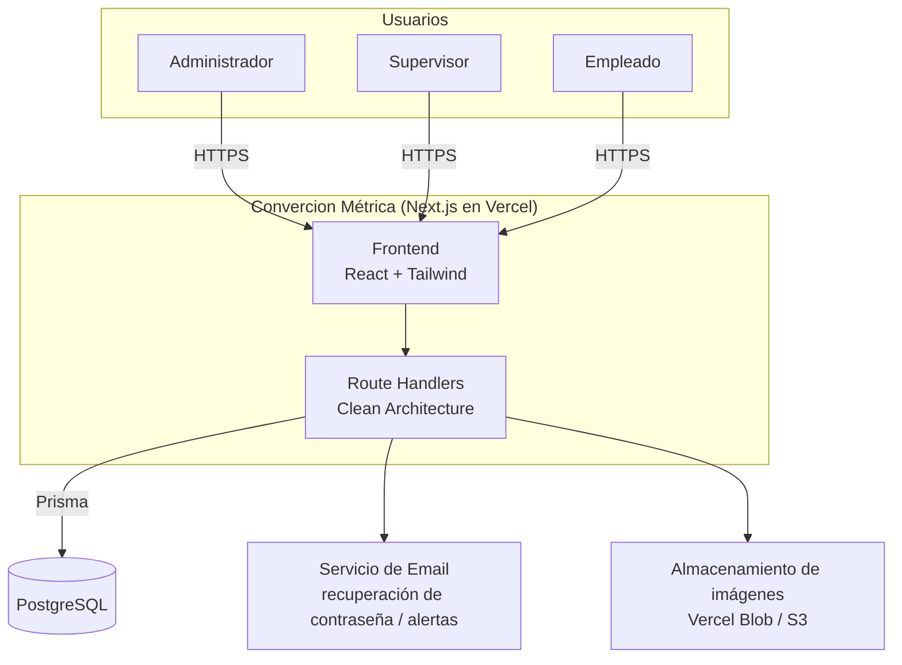

# 01 · Visión general de la arquitectura

## 1.1 Propósito del sistema

Convercion Métrica es una **plataforma web privada de control de inventario**
para uso interno de los empleados de la empresa. Su función central es mantener
en todo momento una imagen exacta y auditable del stock, garantizando que:

- Cada usuario accede con credenciales propias y un rol asignado.
- **Todo movimiento de stock queda registrado y nunca se elimina.**
- El inventario se recalcula automáticamente en cada operación.
- Existe una línea de tiempo (historial) completa por producto.
- El sistema es ordenado, rápido, escalable y mantenible durante años.

## 1.2 Principios rectores

Estos principios condicionan todas las decisiones posteriores:

1. **El movimiento es la fuente de verdad (ledger inmutable).**
   El stock no es un número que se "edita"; es el resultado de sumar/restar
   movimientos. Igual que un libro contable: no se borra un asiento, se agrega
   uno de corrección. Esto da trazabilidad total y hace el sistema auditable.

2. **Clean Architecture / separación de capas.**
   La lógica de negocio (dominio) no conoce Next.js, ni Prisma, ni HTTP. Se
   comunica con el exterior mediante *puertos* (interfaces). Esto permite
   cambiar el framework o la base de datos sin reescribir las reglas de negocio,
   y hace el código testeable de forma aislada.

3. **SOLID en la práctica.**
   Responsabilidad única por módulo, dependencias hacia abstracciones,
   inyección de dependencias en un único *composition root*.

4. **Feature-first en el frontend.**
   El código de UI se organiza por funcionalidad de negocio (productos,
   movimientos, dashboard), no por tipo de archivo. Cada feature es un módulo
   cohesivo y desacoplado.

5. **Seguridad por defecto.**
   Autorización verificada en el servidor en cada operación (nunca solo en la
   UI). RBAC granular. Auditoría de accesos y acciones sensibles.

6. **Rendimiento medible.**
   Índices diseñados desde el modelo de datos, paginación en todas las listas,
   consultas agregadas para el dashboard, cache donde aporta.

## 1.3 Alcance funcional (módulos)

```
┌──────────────────────────────────────────────────────────────┐
│                    CONVERCION MÉTRICA (WMS)                    │
├──────────────┬──────────────┬───────────────┬────────────────┤
│  Identidad   │   Catálogo   │   Inventario  │   Observabilidad│
│  & Accesos   │              │   & Movimien. │                 │
├──────────────┼──────────────┼───────────────┼────────────────┤
│ · Login      │ · Productos  │ · Niveles de  │ · Dashboard     │
│ · Recuperar  │ · Categorías │   stock por   │ · Reportes      │
│   contraseña │ · Marcas     │   ubicación   │   (PDF/Excel)   │
│ · Sesiones   │ · Proveedores│ · Ingresos    │ · Notificaciones│
│ · Roles y    │ · Unidades   │ · Salidas     │   y alertas     │
│   permisos   │ · Almacenes  │ · Transfer.   │ · Historial /   │
│ · Auditoría  │ · Ubicaciones│ · Ajustes     │   timeline      │
│ · Último     │              │ · Reservas    │ · Búsqueda y    │
│   acceso     │              │               │   filtros       │
└──────────────┴──────────────┴───────────────┴────────────────┘
```

## 1.4 Diagrama de contexto (C4 nivel 1)



## 1.5 Vista de capas (Clean Architecture)

Las dependencias apuntan siempre **hacia adentro**. El dominio no depende de
nada externo.

```
        ┌─────────────────────────────────────────────┐
        │  PRESENTACIÓN (Next App Router)               │
        │  Páginas, componentes, Route Handlers (API)   │
        │  → Traduce HTTP ⇄ casos de uso                │
        └───────────────────┬───────────────────────────┘
                            │ depende de ↓
        ┌───────────────────▼───────────────────────────┐
        │  APLICACIÓN (casos de uso)                     │
        │  Orquesta el dominio. Define PUERTOS (interf.) │
        │  Ej: RegistrarMovimiento, CrearProducto        │
        └───────────────────┬───────────────────────────┘
                            │ depende de ↓
        ┌───────────────────▼───────────────────────────┐
        │  DOMINIO (núcleo, sin frameworks)              │
        │  Entidades, value objects, reglas de negocio   │
        │  Ej: Stock, Movimiento, invariantes de stock   │
        └────────────────────────────────────────────────┘
                            ▲ implementa puertos
        ┌───────────────────┴───────────────────────────┐
        │  INFRAESTRUCTURA                               │
        │  Repositorios Prisma, email, storage, logger   │
        │  → Adapta el mundo externo a los puertos       │
        └────────────────────────────────────────────────┘
```

**Ejemplo concreto del flujo "registrar un ingreso":**

1. El Route Handler `POST /api/movements` recibe la petición, valida el
   esquema (Zod) y verifica permisos.
2. Invoca el caso de uso `RegisterMovementUseCase` pasándole datos ya validados.
3. El caso de uso carga el `Product`/`StockLevel` a través del *puerto*
   `StockRepository`, aplica la regla de dominio (calcular `stockAfter`,
   validar que no quede negativo salvo en ajustes), crea la entidad
   `StockMovement` inmutable y persiste todo en una **transacción**.
4. La implementación concreta del puerto (Prisma) hace el trabajo real contra
   PostgreSQL.
5. Se disparan efectos secundarios (evaluar alertas de stock bajo).

El dominio (paso 3) no sabe que existe HTTP, Next o Prisma. Por eso es testeable
y portable.

## 1.6 Atributos de calidad priorizados

| Atributo        | Cómo se garantiza |
|-----------------|-------------------|
| **Trazabilidad**| Ledger inmutable de movimientos + tabla de auditoría |
| **Consistencia**| Transacciones atómicas al mover stock; `stockBefore/After` |
| **Rendimiento** | Índices dedicados, paginación, agregados para dashboard |
| **Escalabilidad**| Modelo multi-almacén/ubicación; capas desacoplables |
| **Mantenibilidad**| Clean Architecture, feature-first, TypeScript estricto |
| **Seguridad**   | RBAC server-side, sesiones, hashing de contraseñas, auditoría |

## 1.7 Decisiones que se documentan por separado

- **Backend: Next Route Handlers vs NestJS** → ver `02-tech-stack.md`.
- **Multi-almacén y stock por ubicación** → ver `03-data-model.md`.
- **RBAC granular vs rol simple** → ver `06-security-rbac.md`.
