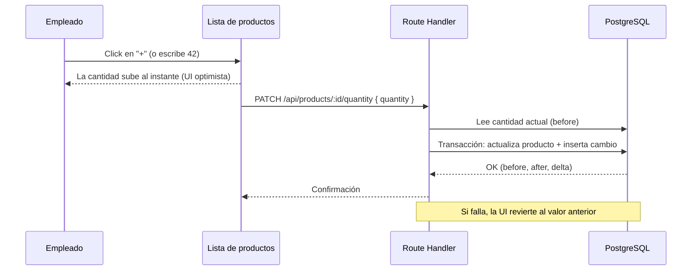

# 01 · Visión general (versión simplificada)

## 1.1 Qué hace el sistema

Convercion Métrica es una plataforma web privada para **llevar el stock de los
productos** de la empresa, con el mínimo de piezas posible:

- Cada empleado **inicia sesión** con su usuario.
- Ve una **lista de productos** con sus códigos, su nombre y su **cantidad**.
- **Ajusta la cantidad** de cada producto: con flechas **−/+** (de a 1 unidad) o
  escribiendo el número directamente.
- Cada cambio de cantidad se **registra automáticamente** (quién, cuándo,
  antes → después).

Nada más. Sin almacenes, sin ubicaciones, sin categorías, sin proveedores, sin
reservas. Si el negocio lo pide en el futuro, la arquitectura permite crecer;
hoy se mantiene deliberadamente simple.

## 1.2 Los tres conceptos del sistema

```
┌───────────────┐        ┌──────────────────┐        ┌────────────────────┐
│    USUARIO    │        │     PRODUCTO     │        │  CAMBIO DE CANTIDAD │
│  (empleado)   │        │                  │        │     (historial)     │
├───────────────┤        ├──────────────────┤        ├────────────────────┤
│ · email       │        │ · códigos        │        │ · antes             │
│ · contraseña  │        │ · nombre         │        │ · después           │
│ · último      │  hace  │ · cantidad ◄─────┼─registra─ · diferencia (±)   │
│   acceso      │───────►│                  │        │ · fecha y hora      │
└───────────────┘        └──────────────────┘        │ · usuario           │
                                                      └────────────────────┘
```

Un **usuario** ajusta la **cantidad** de un **producto**, y ese ajuste genera un
**cambio de cantidad** (el historial). Esa es toda la lógica.

## 1.3 Flujo principal: ajustar cantidad



Puntos clave:

- La actualización del producto y el registro del historial ocurren en **una
  sola transacción**: o pasan las dos cosas, o ninguna. Nunca queda un cambio de
  cantidad sin su registro, ni al revés.
- El servidor calcula `before`, `after` y `delta` para que el historial sea
  confiable (no se confía en lo que dice el cliente).
- La UI es **optimista**: la cantidad cambia en pantalla al instante y, si el
  servidor falla, se revierte. Detalle en `06-quantity-stepper.md`.

## 1.4 Principios que se mantienen

Aunque el sistema es chico, conserva las buenas prácticas que permiten crecer:

1. **El historial no se borra.** Los cambios de cantidad son un registro
   append-only (solo se agregan, nunca se editan ni eliminan).
2. **Autorización en el servidor.** La sesión se valida en el backend, no solo
   en la UI.
3. **Validación en el borde.** Todo dato que entra se valida (Zod) antes de
   tocar la base de datos.
4. **Código desacoplado.** La lógica de negocio (ajustar cantidad y registrar el
   cambio) vive separada del framework, para poder testearla y cambiarla sin
   dolor.
5. **Tipado extremo a extremo.** TypeScript + Prisma: si cambia una columna, el
   compilador avisa qué se rompe.

## 1.5 Alcance explícito

| Incluido en esta versión | Fuera de alcance (por ahora) |
|--------------------------|------------------------------|
| Login por empleado | Roles / permisos granulares |
| Productos con códigos, nombre y cantidad | Categorías, marcas, proveedores, unidades |
| Ajuste de cantidad (flechas + input) | Almacenes, ubicaciones, reservas |
| Historial de cambios de cantidad | Transferencias entre depósitos |
| Buscador básico de productos | Reportes PDF/Excel, notificaciones |

Estos "fuera de alcance" quedan documentados como posibles fases futuras, pero
**no se construyen** hasta que se pidan.
