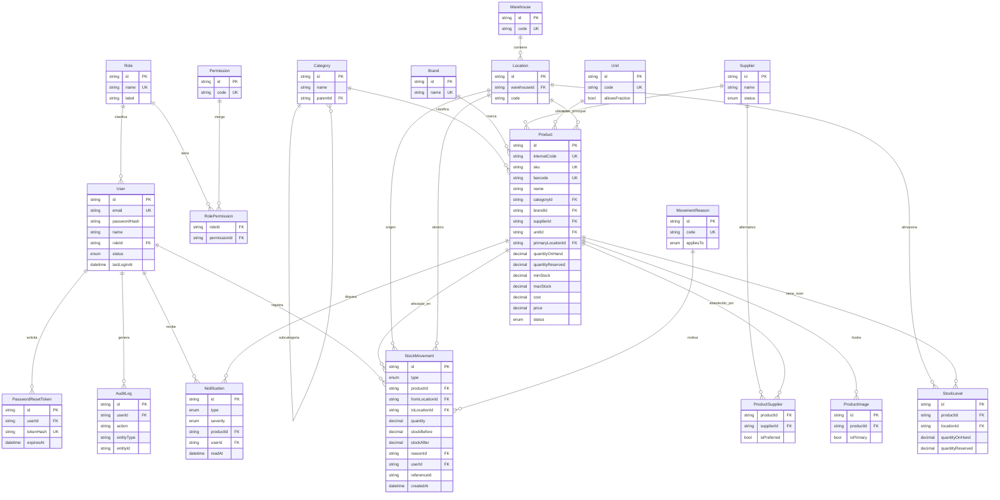

# 04 · Diagrama entidad-relación

Representación visual del modelo definido en
[`03-data-model.md`](03-data-model.md). Renderiza como diagrama en cualquier
visor compatible con Mermaid (GitHub incluido).

## 4.1 Diagrama ER completo

## 4.2 Lectura del diagrama por módulos

- **Accesos:** `Role → User`, y `Role ↔ Permission` (vía `RolePermission`)
  definen quién puede hacer qué. `AuditLog` y `PasswordResetToken` cuelgan de
  `User`.
- **Catálogo:** `Product` es el hub, con FKs a `Category` (auto-jerárquica),
  `Brand`, `Supplier`, `Unit` y su ubicación principal. Imágenes y proveedores
  alternativos en 1:N / N:M.
- **Almacén:** `Warehouse → Location`. El stock real vive en `StockLevel`
  (Producto × Ubicación).
- **Movimientos:** `StockMovement` conecta `Product`, `User`, ubicaciones de
  origen/destino y `MovementReason`. Es el ledger inmutable.
- **Observabilidad:** `Notification` se relaciona con `Product` y `User`.

## 4.3 Cardinalidades destacadas

| Relación | Tipo | Nota |
|----------|------|------|
| Product ↔ Location (stock) | N:M vía `StockLevel` | un producto en varias ubicaciones |
| Product ↔ Supplier | N:M vía `ProductSupplier` | + FK `supplierId` = proveedor principal |
| Category ↔ Category | 1:N auto-referencia | categoría / subcategoría |
| Role ↔ Permission | N:M vía `RolePermission` | RBAC granular |
| Product ↔ StockMovement | 1:N | historial / timeline por producto |
