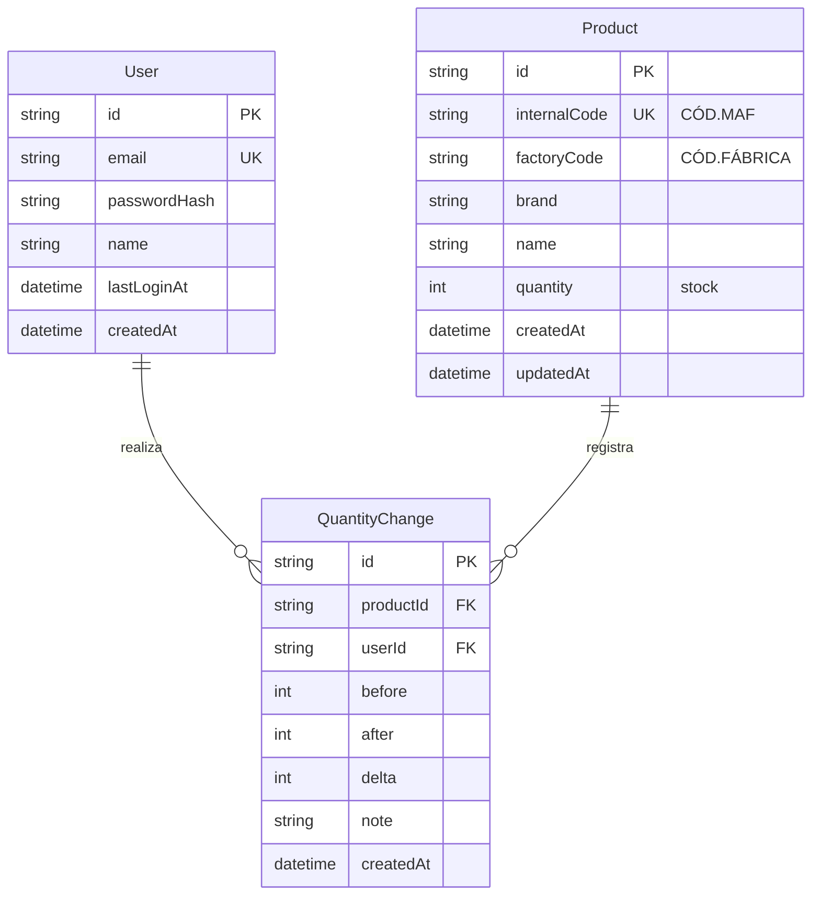

# 04 · Diagrama entidad-relación (versión simplificada)

Modelo definido en [`03-data-model.md`](03-data-model.md). Solo tres entidades de
negocio.

## Cómo leerlo

- Un **usuario** realiza muchos **cambios de cantidad** (1:N).
- Un **producto** acumula muchos **cambios de cantidad** a lo largo del tiempo
  (1:N) → esa es su línea de tiempo / historial.
- `QuantityChange` es la tabla puente que conecta *quién* (usuario) cambió *qué*
  (producto) y *cuánto* (before → after, delta), *cuándo* (createdAt).

Nada más. Simple y trazable.
